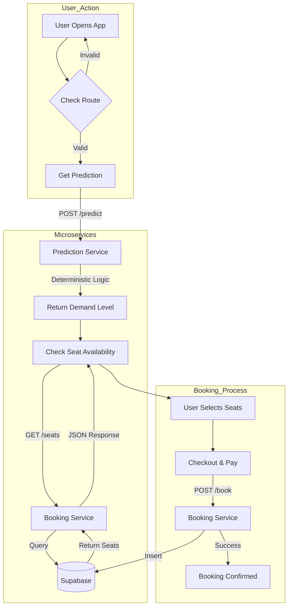

#  Sleeper Bus Ticket Booking System

## 1. Project Overview
A robust, full-stack microservices application designed for booking sleeper bus tickets. The system features real-time seat availability, multi-passenger booking, and an AI-driven deterministic engine to forecast ticket demand and pricing. 

Built with **FastAPI** (Backend), **Streamlit** (Frontend), and **Supabase** (PostgreSQL).

---

## 2. Features

- **Smart Booking**: 
  - Visual seat map with real-time status: **Green** (Available), **Red** (Booked/Occupied), **Grey** (Unavailable).
  - Multi-deck support (Upper/Lower).

- **Multi-Passenger Support**: 
  - Select up to 6 seats in a single transaction.
  - Individual passenger details (Name, Age, Meal preferences) for each seat.

- **Demand Forecasting**: 
  - **AI-Driven Prediction**: Forecasts demand (High/Medium/Low) and confirmation probability.
  - **Factors**: Analyzes route distance, travel date (weekend vs. weekday), and seasonality.

- **Deterministic Logic**: 
  - Uses **SHA-256 hashing** of input parameters (Date + Route) to ensure the prediction engine always returns consistent results for the same query, simulating a stable trained model.

- **User Dashboard**: 
  - "My Bookings" page to view booking history.
  - Cancellation functionality for existing bookings.

---

## 3. File & Folder Structure

```
Sleeper-Bus-Ticket-Booking-System/
├── booking_service/           # Microservice: Booking Management (Port 8000)
│   ├── routers/               # API Routes (bookings.py)
│   ├── services/              # Business Logic (booking_logic.py)
│   ├── schemas.py             # Pydantic Models
│   └── main.py                # Entry Point
│
├── prediction_service/        # Microservice: Demand Prediction (Port 8001)
│   ├── engine.py              # Deterministic Prediction Logic
│   └── main.py                # Entry Point
│
├── frontend/                  # User Interface (Port 8501)
│   └── app.py                 # Streamlit Application
│
├── common/                    # Shared Library
│   ├── config.py              # Centralized Settings (Pydantic)
│   └── logger.py              # Centralized Logging (Loguru)
├── requirements.txt           # Dependencies
├── run_app.bat                # Startup Script (Windows)
└── README.md                  # Documentation
```

---

## 4. System Architecture



---

## 5. Installation & Running Steps

### Prerequisites
- Python 3.10+
- Supabase Account and Project

### Setup
1. **Clone the repository**
2. **Create Virtual Environment**:
   ```bash
   python -m venv .venv
   ```
3. **Install Dependencies**:
   ```bash
   .venv\Scripts\activate
   pip install -r requirements.txt
   ```
4. **Environment Variables**:
   Create a `.env` file in the root directory:
   ```env
   SUPABASE_URL=your_supabase_url
   SUPABASE_KEY=your_supabase_anon_key
   SERVICE_NAME=booking-system
   ```

### Running the Services

**Option A: Automated (Windows)**
Simply run the included batch script:
```cmd
run_app.bat
```

**Option B: Manual (Terminal)**
Open 3 separate terminals:

1. **Booking API (Port 8000)**
   ```bash
   uvicorn booking_service.main:app --reload --port 8000
   ```

2. **Prediction API (Port 8001)**
   ```bash
   uvicorn prediction_service.main:app --reload --port 8001
   ```

3. **Frontend (Port 8501)**
   ```bash
   streamlit run frontend/app.py
   ```

---

## 6. Database Setup (SQL)

Ensure your Supabase project has the required tables. Run the provided SQL scripts (if available) or create them manually:

- **`stations`**: `id, name, sequence_order`
- **`meals`**: `id, name, type, price`
- **`bookings`**: `id, seat_id, start_station_id, end_station_id, travel_date, status, passenger_name`
- **`booking_meals`**: `id, booking_id, meal_id`
- **`seats`**: `id, seat_number, type`
- **RPC Function**: `get_available_seats` (for filtering booked seats)

---

## 7. Test Cases

| ID | Test Scenario | Steps | Expected Result |
|----|--------------|-------|-----------------|
| **TC01** | **Verify Seat Availability** | 1. Select Route & Date.<br>2. Click "Check Availability". | Available seats appear **Green** and clickable. Booked seats appear **Red** and disabled. |
| **TC02** | **Max Booking Limit** | 1. Set "Passengers" to 2.<br>2. Try selecting 5 seats. | System shows a warning toast: "⚠️ You can only select 2 seats." and prevents extra selection. |
| **TC03** | **Demand Consistency** | 1. Check prediction for Date X.<br>2. Change date, then change back to Date X. | The **Confirmation Probability %** must be identical both times (Deterministic Logic). |
| **TC04** | **Successful Checkout** | 1. Select 2 Seats.<br>2. Fill details & Meals.<br>3. Confirm. | Success balloon animation appears. Booking ID is shown. Verified in "My Bookings". |

---